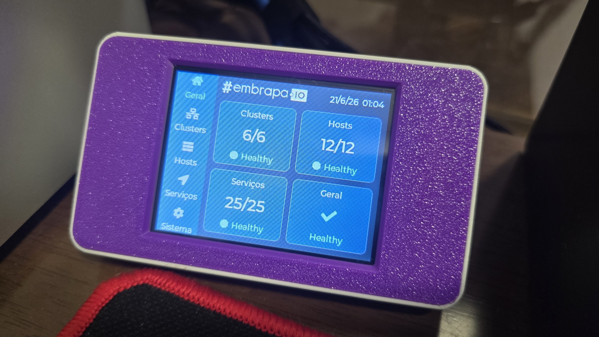
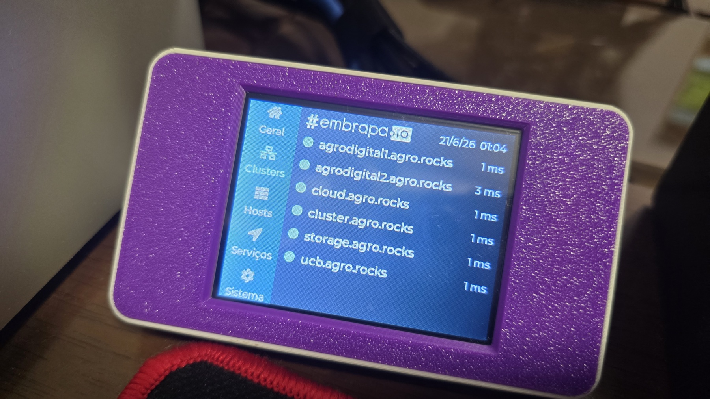
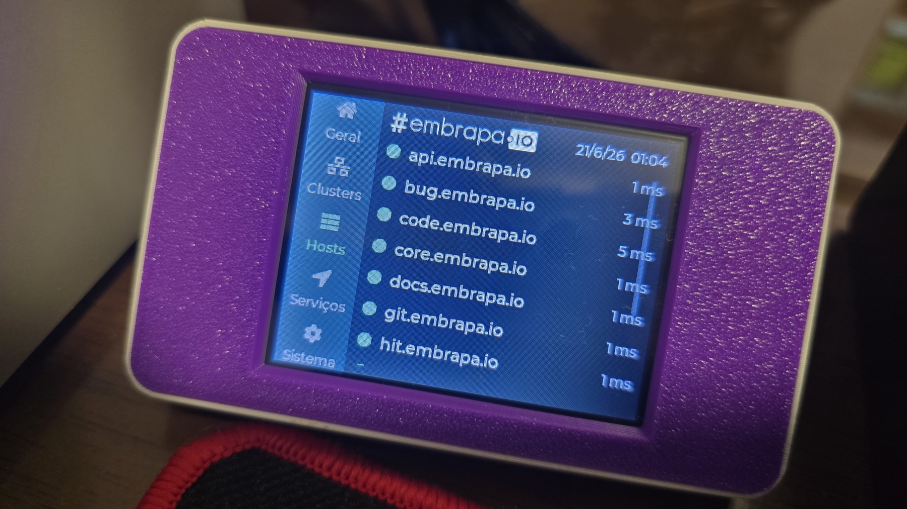
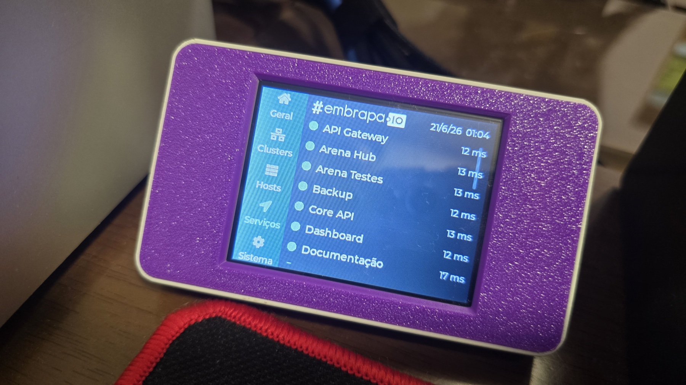
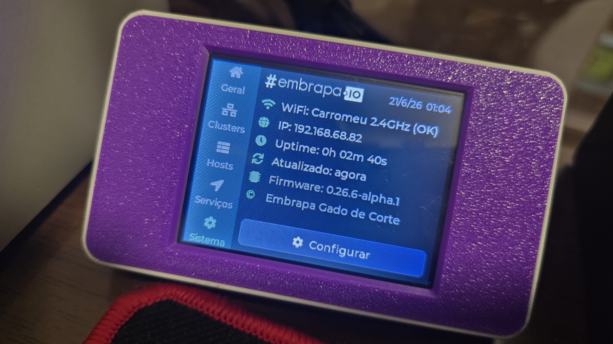

<h1 align="center">🖥️ Desk Buddy — Embrapa I/O</h1>

  <b>Um painel de mesa que mostra, em tempo real, a saúde da plataforma <a href="https://status.embrapa.io">Embrapa I/O</a></b> 
  clusters, hosts e serviços — num pequeno display colorido com toque.

  

  
  &nbsp;

---

## O que é

O **Desk Buddy** fica na sua mesa e, sem que você precise abrir nada, mostra se a **plataforma
Embrapa I/O está no ar**. Ele lê o monitoramento oficial (**Gatus**, em
[status.embrapa.io](https://status.embrapa.io)) e exibe o estado de **clusters**, **hosts** e
**serviços** com a mesma linguagem do painel (`Healthy` / `N off`). Tem **navegação por toque**,
**relógio**, e é **configurado pela própria tela** (Wi-Fi, fuso, brilho) — sem cabo nem computador.

É feito com um **Cheap Yellow Display (CYD / ESP32)** dentro de um case impresso em 3D. Sempre
ligado, alimentado por USB.

## As telas

| | |
|---|---|
|  | **Visão Geral** — um resumo de tudo: Clusters, Hosts, Serviços e o veredito **Geral**, cada um com quantos estão no ar e o status (`Healthy` / `N off`). |
|  | **Clusters** — lista dos clusters com indicador de status e a latência de cada um. |
|  | **Hosts** — lista dos hosts monitorados (rolável), com status e latência. |
|  | **Serviços** — lista dos serviços; o que estiver fora do ar aparece em destaque no topo. |
|  | **Sistema** — Wi-Fi/IP, tempo ligado, última atualização, versão e o botão **Configurar**. |

> A navegação é pelo **menu lateral** (Geral · Clusters · Hosts · Serviços · Sistema).

## 🛒 O que você vai precisar

| Item | Onde comprar | Preço aprox. |
|---|---|---|
| **Placa CYD** (ESP32-2432S028R, 2.8" touch) | [AliExpress](https://pt.aliexpress.com/item/1005011857768315.html) | ~US$ 10 + impostos |
| **Conector USB-C fêmea com DuPont** (alimentação) | [AliExpress](https://pt.aliexpress.com/item/1005005823388148.html) | ~US$ 0,50/un (kit de 10) + impostos |
| Carregador **USB 5 V** + cabo USB-C | (provavelmente você já tem) | — |

> O conector USB-C já vem com plugue **DuPont**, que encaixa nos jumpers que acompanham a placa —
> liga em **VIN (+5 V)** e **GND**. **Confira a polaridade** antes de energizar. Detalhes em
> [docs/tech-spec.md](docs/tech-spec.md).

## 🖨️ Imprimindo o case

Usamos o modelo **CYD Desk Buddy** da comunidade (MakerWorld):
**https://makerworld.com/pt/models/2787810-cyd-desk-buddy-for-bambu-lab-home-assistant**

  

## 🔧 Instalando o firmware

> **Gravador web — 1 clique, sem instalar nada:** abra **[buddy.embrapa.io](https://buddy.embrapa.io)**
> no **Google Chrome** ou **Microsoft Edge** (no computador), conecte o CYD por USB e clique em **Instalar**.

Quer compilar do código ou customizar? Veja **[docs/tech-spec.md](docs/tech-spec.md)**.

**Na primeira vez que ligar**, o Desk Buddy abre sozinho a tela de **Configuração**: digite o nome e
a senha do seu **Wi-Fi (2,4 GHz)** pela tela de toque, salve, e pronto — ele se conecta e começa a
mostrar o status. Depois, dá para trocar Wi-Fi, fuso horário, intervalo de atualização e brilho a
qualquer momento em **Sistema → Configurar**.

## 🛠️ Quer customizar?

O firmware é aberto e dá para adaptar (outra fonte de dados, cores, telas, fusos). Veja a
**[documentação técnica](docs/tech-spec.md)**.

## Licença e créditos

[MIT](LICENSE) · Desenvolvido pela **Embrapa Gado de Corte**.
Usa [LVGL](https://lvgl.io), [TFT_eSPI](https://github.com/Bodmer/TFT_eSPI) e a API do
[Gatus](https://github.com/TwiN/gatus).
